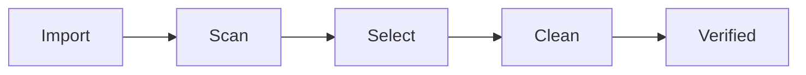

# metadata-editor-tool 🧹✨

  

*Strip the hidden story your files tell about you — in one click, on your own machine.*

  

---

## 📖 Overview

Every photo, PDF, and office document you create carries a shadow file inside it — a quiet ledger of camera models, GPS coordinates, author names, edit timestamps, and software fingerprints. That's **metadata**, and most people never see it because it doesn't show up when you double-click a file. `metadata-editor-tool` exists to make that invisible ledger visible, editable, and — when you want — completely gone.

We built this as a **Metadata Remover** first and an editor second. The removal path is one button. The editing path is for people who want more control: swap a camera model, blank a GPS tag, rewrite an author field, or selectively keep the metadata that's actually useful (like copyright info) while nuking the rest (like device serial numbers). It's aimed at photographers prepping client deliverables, journalists protecting sources, freelancers scrubbing PDFs before sending contracts, and everyday users who just don't want their vacation photos broadcasting their home coordinates.

Unlike browser-based "upload your file to our server" tools, everything here runs **locally on Windows** — no upload, no cloud round-trip, no mystery server logging your files. Your data never leaves your machine, which is the entire point when the thing you're removing is *sensitive* metadata in the first place.

## 🚀 Download / Get Started

> [!NOTE]
> The badge above links to our project landing page, where you'll always find the current build. We don't publish binaries anywhere else — if you found this tool elsewhere, grab it from the official page instead.

---

## 🔍 What's Inside The Toolbox

- **Bulk File Sweep** — drag in a whole folder of images, PDFs, or Office docs and strip metadata from all of them in a single pass, instead of opening files one-by-one like it's 2015.

- **Selective Field Surgery** — don't want the sledgehammer approach? Pick exactly which fields die (GPS, author, device serial) and which stay (copyright, title).

- **Live Metadata Preview** — see every EXIF, XMP, and IPTC tag laid out in a readable table *before* you touch anything, so you're never guessing what's actually in the file.

- **Format-Aware Engine** — JPEG, PNG, TIFF, PDF, DOCX, and MP4 each store metadata differently under the hood; the tool understands each container instead of treating them all the same.

- **Snapshot & Undo** — every clean-up creates a lightweight backup reference so a misclick doesn't cost you the original file.

- **Drag-and-Drop Workflow** — no menus to dig through for the common case; drop a file, watch it get scrubbed, done.

- **Batch Rename on Export** — optionally strip metadata *and* rename output files by pattern, handy for delivering clean sets to clients.

- **Offline by Design** — zero network calls during processing. What happens on your disk stays on your disk.

> [!TIP]
> If you only ever do one thing with this tool, make it this: run the **Bulk File Sweep** on your phone's camera roll export before sharing it anywhere public. GPS tags are the most common thing people forget about.

---

## 🧭 Getting Started In Four Steps

1. Hit the download badge above to reach the landing page.

2. Grab the current Windows build and save it anywhere on your machine.

3. Run the executable — no setup wizard, no background service, no admin prompt required.

4. Drop in a file (or a folder) and choose **Quick Clean** or **Custom Fields**.

> [!IMPORTANT]
> Always work from a copy of important files until you're comfortable with the interface. The Snapshot & Undo feature helps, but nothing beats keeping your own backup for anything irreplaceable.

---

## 💻 System Requirements

| Requirement | Details |
|---|---|
| OS | Windows 10 or Windows 11 (64-bit) |
| Dependencies | None — fully standalone |
| Install | Not required — portable executable |
| Disk space | Under 100 MB |
| Internet | Not required after download |
| Admin rights | Not required |

---

## ⚙️ How It Works

The pipeline behind `metadata-editor-tool` is deliberately simple, because metadata removal shouldn't need a PhD to understand:

1. **Ingest** — the file is read into memory and its container format is detected.

2. **Parse** — metadata blocks (EXIF/XMP/IPTC/document properties) are located and mapped to a readable schema.

3. **Decide** — you choose full removal or selective field edits.

4. **Rewrite** — a clean version of the file is written out, byte structure preserved, metadata altered or gone.

5. **Verify** — the tool re-reads the output to confirm no leftover tags snuck through.

---

## 🛟 Troubleshooting

<strong>My photo still shows GPS data in another app after cleaning.</strong>

Some viewers cache thumbnails with embedded metadata separately from the main file. Clear the app's thumbnail cache or re-open the cleaned file in a fresh viewer to confirm the actual file data.

<strong>The tool says a PDF is "locked" and won't strip metadata.</strong>

Password-protected or permission-restricted PDFs need to be unlocked first. Remove the restriction in your PDF viewer, then re-run the sweep.

<strong>Can I recover the original metadata after cleaning?</strong>

Only if you kept the Snapshot reference or your own backup. Once a file is overwritten without a snapshot, the original tags are gone by design — that's the whole point of a Metadata Remover.

<strong>Does this work on RAW camera files?</strong>

Common RAW formats are supported for reading and preview, but write-back support varies by manufacturer format. Check the field preview before assuming full removal.

<strong>Batch processing seems to skip a few files.</strong>

Corrupted headers or unsupported sub-formats get flagged and skipped rather than risking a broken output — check the end-of-run log for the skipped list.

<strong>Is my file ever uploaded anywhere during processing?</strong>

No. All parsing, editing, and rewriting happens locally on your machine. There's no network call in the cleaning pipeline.

---

## 🎨 UI / UX Details

  

- **Themes** — Light, Dark, and an Auto mode that follows your Windows setting.

- **Keyboard Shortcuts**:

  - `Ctrl + O` — open file/folder

  - `Ctrl + Shift + C` — quick clean current selection

  - `Ctrl + Z` — undo last cleaning action

  - `Ctrl + F` — search within metadata field list

  - `F5` — refresh preview table

- **Settings persistence** — your last-used field preferences are remembered between sessions.

- **Drag zone** — the entire main window accepts drag-and-drop, not just a small target box.

> [!TIP]
> Enable "Remember field selections" in Settings if you always strip the same tags — it turns repeat cleanups into a two-click operation.

---

## 🤝 Contributing & Community

We're a small but growing community of people who care about digital privacy hygiene. Contributions, bug reports, and feature ideas are always welcome:

- Open an issue describing the metadata format or edge case you hit.

- Fork, branch, and submit a pull request — clear commit messages appreciated.

- Discussion threads are open for feature proposals before you write code, so we can align on approach first.

> [!WARNING]
> Please don't submit files containing real sensitive personal data as test fixtures — use synthetic or already-public sample files instead.

---

## 📜 License

Released under the [MIT License](LICENSE), 2026. Use it, fork it, ship it in your own projects — just keep the license notice intact.

---

## ⚠️ Disclaimer

`metadata-editor-tool` is provided as-is, without warranty of any kind. Metadata removal reduces certain identifying information embedded in files, but it is **not** a guarantee of complete anonymity or security across every possible platform, format, or future re-embedding of data by other software. Always verify sensitive files independently before sharing them publicly.

---

## 📝 Changelog

### v2026.3

- Added batch rename-on-export pattern support

- Improved PDF field detection for nested XMP blocks

- Fixed a crash when previewing corrupted TIFF headers

### v2026.2

- Introduced Snapshot & Undo system

- Dark theme contrast improvements

- Performance pass on Bulk File Sweep for folders with 1000+ files

### v2026.1

- Initial 2026 release

- Core selective field editing for EXIF/XMP/IPTC

- Drag-and-drop workflow and live metadata preview table

---

